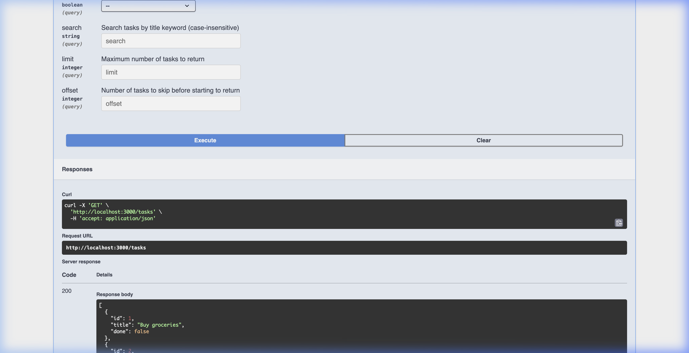

# Task CRUD API (FlyRank Internship - Week 2 - Assignment A1)

A lightweight RESTful CRUD API that manages a to-do list. The application is built using Node.js and Express, storing tasks in-memory. It provides complete API documentation through Swagger UI.

## Features

- **Full CRUD Operations**: Create, Read, Update, and Delete tasks.
- **In-Memory Storage**: Keep track of tasks dynamically in memory.
- **Input Validation**: Rejects invalid requests with detailed `400 Bad Request` responses.
- **Swagger UI Interactive Docs**: Real-time documentation served at `/docs`.
- **Query Parameter Filtering**: Filter tasks by `done` status.
- **Keyword Search**: Search tasks by matching keywords in their titles.
- **Pagination**: Use `limit` and `offset` query parameters.
- **Stats Endpoint**: Retrieve total, done, and open task counts.
- **Database Reset**: Restore initial mock tasks instantly.

---

## Getting Started

### 1. Installation

Install all required dependencies:
```bash
npm install
```

### 2. Run the Server

Start the application locally on port `3000`:
```bash
npm start
```
*(Alternatively, for development with auto-reload, run: `npm run dev`)*

Once started, the server will output:
```
Server running on http://localhost:3000
```

---

## API Endpoints Reference

| HTTP Method | Endpoint | Description | Expected Status Codes |
| :--- | :--- | :--- | :--- |
| **GET** | `/` | API description & metadata | `200 OK` |
| **GET** | `/health` | Check API server status | `200 OK` |
| **GET** | `/tasks` | Retrieve all tasks (supports query filters) | `200 OK` |
| **GET** | `/tasks/:id` | Retrieve a single task by ID | `200 OK`, `404 Not Found` |
| **POST** | `/tasks` | Create a new task | `201 Created`, `400 Bad Request` |
| **PUT** | `/tasks/:id` | Update task title and/or completion | `200 OK`, `400 Bad Request`, `404 Not Found` |
| **DELETE** | `/tasks/:id` | Remove a task | `204 No Content`, `404 Not Found` |
| **GET** | `/stats` | View task completion statistics | `200 OK` |
| **POST** | `/reset` | Reset memory state to initial tasks | `200 OK` |

---

## Sample Request & Response

### Creating a Task

#### Request:
```bash
curl -i -X POST http://localhost:3000/tasks \
  -H "Content-Type: application/json" \
  -d '{"title":"Buy milk"}'
```

#### Response:
```http
HTTP/1.1 201 Created
X-Powered-By: Express
Content-Type: application/json; charset=utf-8
Content-Length: 40
ETag: W/"28-PpSBYV7i68cXyGc7AhjVpkZkY5Q"
Date: Mon, 27 Jul 2026 13:28:03 GMT
Connection: keep-alive
Keep-Alive: timeout=5

{"id":4,"title":"Buy milk","done":false}
```

---

## Swagger UI Documentation

Swagger UI is served locally at [http://localhost:3000/docs/](http://localhost:3000/docs/). It allows users to test the endpoints directly from the browser.



---

## Observations & Experiments

### The Mortality Experiment

When we create new tasks, update their completion statuses, or delete them, the changes are stored in-memory in the Express server's variables. If the server is restarted (e.g., stopping the terminal process and running `npm start` again), all data resets to the original three example tasks. 

**Why does this happen?**
In-memory storage lives in the RAM allocated to the running Node.js process. When the process terminates, its memory space is reclaimed by the operating system, erasing all runtime states. When the server starts up again, it initialises the tasks array from scratch. To make data survive restarts, we need a persistent storage system, such as a database (SQL or NoSQL) or local file storage.

### Why Real APIs Use Pagination

Real-world applications can have thousands or millions of records. If `GET /tasks` returns all tasks:
1. **Network Overhead**: Transferring megabytes of JSON over the network increases latency and costs.
2. **Server & Database Load**: Querying and serialising huge datasets consumes CPU and memory.
3. **Browser Crash**: Rendering extremely large JSON arrays in the client causes performance issues or crashes.

Pagination (`limit` & `offset`) ensures the server only loads and transmits a manageable chunk of data at a time.
