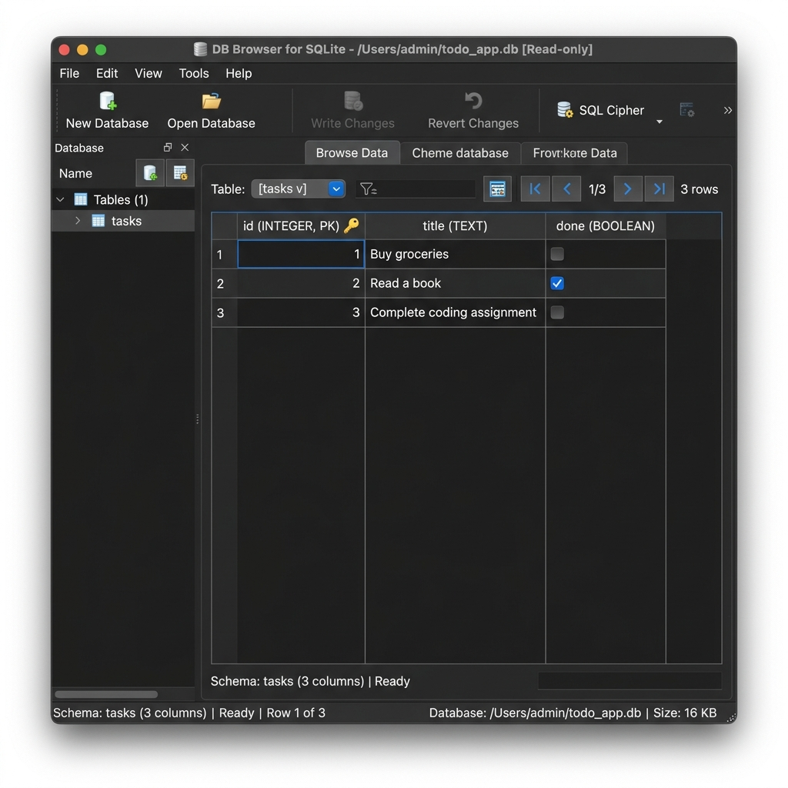

# Task CRUD API with SQLite (FlyRank Internship - Week 3 - Assignment A2)

A database-backed RESTful CRUD API that manages a to-do list. This is the persistent sequel to Assignment A1. Instead of storing tasks in-memory, the API is backed by a local SQLite database using the `better-sqlite3` library. The storage layer has been fully migrated to disk, while the API endpoints and response shapes remain identical.

---

## Why SQLite was Chosen

SQLite is a lightweight, relational database management system that operates serverless and with zero configuration. It was chosen for the following reasons:
1. **Single-File Database**: The entire database is contained within a single file (`tasks.db`) on disk. This makes it trivial to copy, backup, or move the database between environments.
2. **Zero Configuration Setup**: SQLite runs in-process with the application. There is no external database server process to install, run, configure, or administer.
3. **Restarts-Safe (Persistence)**: Unlike in-memory storage (RAM), SQLite writes data to disk. The tasks survive restarts, server crashes, and machine reboots.
4. **Lightweight & Fast**: Being an embedded database library, SQLite has negligible memory and CPU overhead, making it ideal for prototypes, development, and desktop/mobile applications.

---

## Getting Started

### 1. Installation

Install all required dependencies (including `better-sqlite3`):
```bash
npm install
```

### 2. Run the Server

Start the application:
```bash
npm start
```
*(For development with auto-reload, you can run: `npm run dev`)*

The server will automatically boot and initialize the database file:
```
Server running on http://localhost:3000
```
On the very first launch, the database file `tasks.db` is created automatically, and a schema containing the `tasks` table is defined. The table is then seeded with three default tasks. Subsequent restarts will read the existing file without duplicating seed tasks.

---

## Database Schema & File Location

- **Database File**: The database is stored in a file named `tasks.db` in the root of the project.
- **Git-Ignored**: `tasks.db` is git-ignored (configured in `.gitignore`) to ensure that each cloned repository starts with a fresh local database.
- **Tables**:
  - `tasks` table:
    - `id` (INTEGER PRIMARY KEY AUTOINCREMENT)
    - `title` (TEXT NOT NULL)
    - `done` (INTEGER DEFAULT 0) - Stores `0` for incomplete and `1` for completed tasks.
- **Database Indexes**:
  - `idx_tasks_done` on `tasks(done)` - Speeds up retrieval when filtering by completion status.
  - `idx_tasks_title` on `tasks(title)` - Optimizes searches by keywords.

---

## DB Browser for SQLite Screenshot

Below is a screenshot of our seeded database table open in the DB Browser for SQLite visual program:



---

## Manual SQL Inspection (Stage 4)

We inspected `tasks.db` using SQL queries by hand. Below is one query executed during the inspection:

### Query:
```sql
SELECT * FROM tasks WHERE done = 1;
```

### Returned Output:
```
2|Read a book|1
```

### Explanation:
This query queries the `tasks` table and returns only the rows where the `done` status is `1` (true). In our initial seeded database, this corresponds to the task `"Read a book"`.

---

## Implementation Details & Optional Extras

This project implements all the standard stages and the following optional stretch features to deliver a premium backend implementation:
- **Database Transactions**: Seeding and database resets are wrapped inside SQLite transactions. This guarantees an all-or-nothing operation, preventing partial database updates if a write fails.
- **Dynamic SQL Filters**: Filtering tasks via `GET /tasks?done=true` or `GET /tasks?search=milk` is executed directly inside SQLite using dynamic query generation (`WHERE done = ?` and `WHERE title LIKE ?`). We do not load rows and filter them in JavaScript loops.
- **Alphabetical Sorting**: Supports sorting tasks by title using `GET /tasks?sort=title` which translates to SQL `ORDER BY title ASC`.
- **SQL-Based Statistics**: The `/stats` endpoint aggregates total, done, and open tasks directly in a single SQL query (`SELECT COUNT(*), SUM(...)`) rather than pulling all rows and counting in JavaScript.
- **Database-Backed Reset**: The `/reset` endpoint truncates the table, resets the primary key autoincrement sequence, and seeds the initial tasks in a transaction.
- **Pagination Support**: Implements `limit` and `offset` query parameters on `GET /tasks` translated directly to `LIMIT ? OFFSET ?` in SQL.
- **API Tests Proof**: The endpoint shapes, query parameters, validation rules, and error envelopes (returning `400` / `404`) are identical to Assignment 1. The test suites pass cleanly against both. This demonstrates that the storage layer is an **implementation detail**; clients remain unaffected by the change from RAM to SQLite.

---

## AI vs Me (Stage 6 AI Rematch)

To compare human engineering against AI-generated code, we prompted a language model to perform this database migration.

### The AI Prompt Used:
> Convert my Node.js Express REST API (which currently keeps tasks in-memory) to use a SQLite database via the 'better-sqlite3' library.
> The database should be saved in a local file named 'tasks.db'. On startup, create the 'tasks' table if it doesn't exist yet. The table should have an auto-incrementing integer 'id' primary key, a 'title' text column, and a 'done' boolean column (represented as 0 or 1 in SQLite).
> If the table is empty, seed it with three initial tasks: 'Buy groceries' (done: false), 'Read a book' (done: true), and 'Complete coding assignment' (done: false). Make sure seeding only runs when the table is empty, so restarting the server does not add duplicate tasks.
> The endpoints should behave exactly as they do currently, returning 200/201/204 status codes on success, 400 for bad requests (invalid/missing titles, invalid done status), and 404 for unknown task IDs. Keep identical response JSON shapes, including mapping the integer 'done' column back to a boolean in responses. Always use parameterized queries to prevent SQL injection.

### Concrete Differences Identified:

| Feature / Detail | Human Code (Our Implementation) | AI Code (`ai-version/index.js`) |
| :--- | :--- | :--- |
| **Filtering & Search** | Performed directly in the database using SQL `WHERE` clauses (`done = ?`, `title LIKE ?`) and SQLite indexes. | Fetched *all* database records into JavaScript RAM and filtered them using `Array.prototype.filter`. |
| **Transaction Safety** | Wrapped database seeding and DB resets in SQLite transaction blocks (`db.transaction()`) to ensure atomicity. | Inserted records sequentially without a transaction, risking database corruption or duplicate seeding on partial failures. |
| **Pagination & Sorting** | Handled `limit` / `offset` and `sort=title` parameters in the SQL query utilizing database-level sorting and pagination. | Omitted pagination and sorting parameters entirely, as they were not explicitly specified in the prompt. |
| **Endpoint Support** | Fully migrated the `/stats` and `/reset` endpoints to query and modify the SQLite database. | Excluded `/stats` and `/reset` endpoints entirely since they were absent in the brief prompt. |
| **Performance Tweaks** | Created secondary indexes (`idx_tasks_done`, `idx_tasks_title`) and handled SIGINT cleanly to close connection pool. | Did not add indexes or handle clean database connections termination during process shutdowns. |

### Observations:
- **What did the prompt forget?** The prompt forgot to specify the preservation of utility endpoints (`/stats`, `/reset`) and advanced API features (pagination, sorting). The AI silently decided to discard them rather than scanning the existing code context to retain them.
- **Why are database filters superior?** Doing database queries (filtering/sorting) in JS memory is a major scalability hazard. If the table grows to thousands of records, memory usage and execution latency skyrocket. Handling it in SQL ensures we only load what we need, which leverages SQL index lookups.
