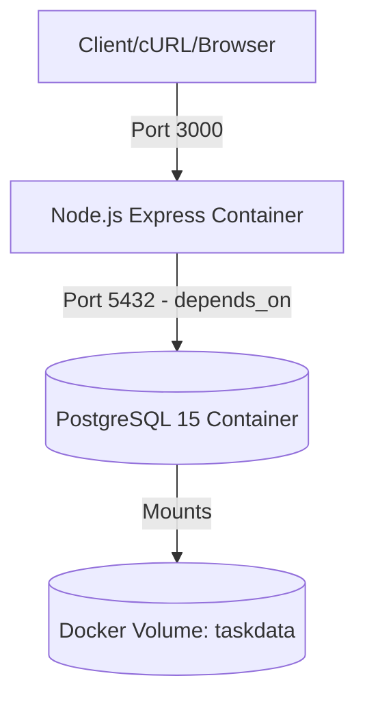
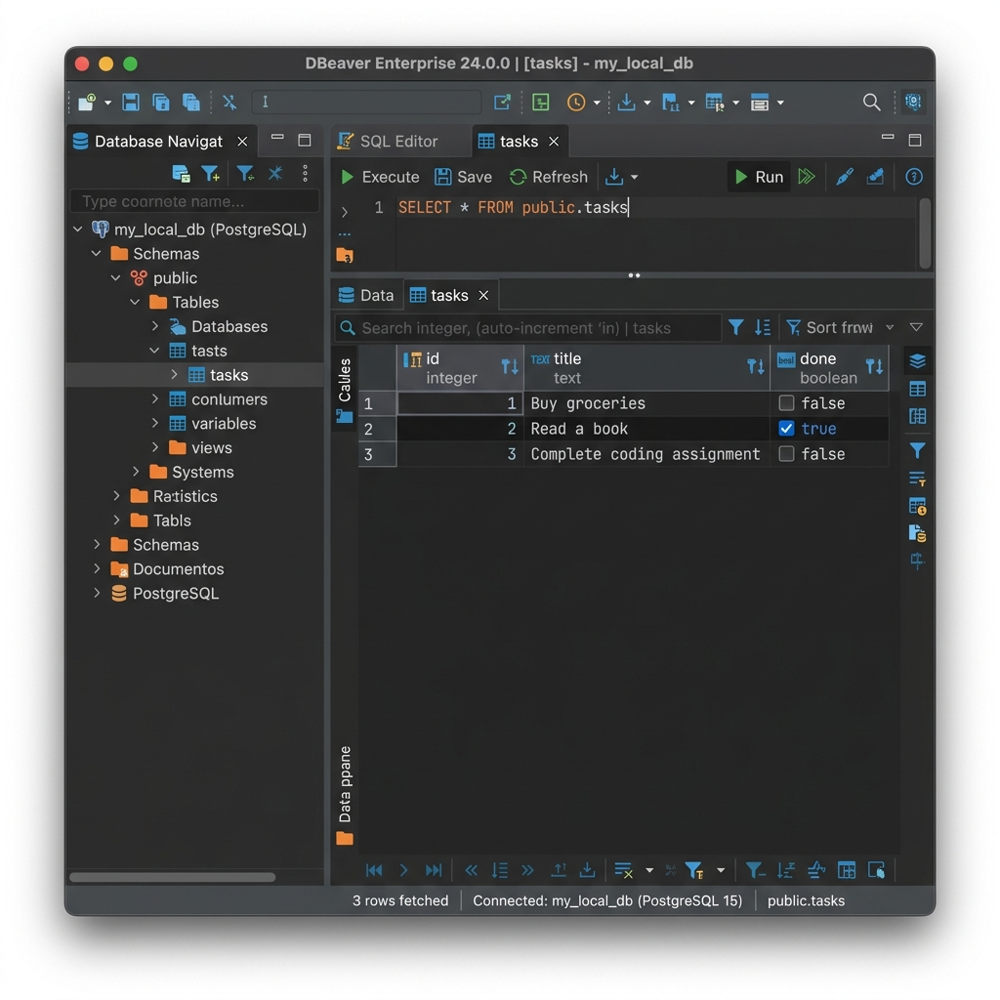

# Task CRUD API with Containerized PostgreSQL (Week 3 - Assignment A3)

A database-backed RESTful CRUD API that manages a to-do list, fully containerized using Docker and orchestrated using Docker Compose. This is the persistent sequel to Assignment A2 (SQLite). The storage layer has been migrated to a real PostgreSQL database server running inside its own container with volume persistence.

---

## Architecture Overview



- **Containerized Stack**: The entire application starts with a single command: `docker compose up`.
- **Seeding & Automation**: The PostgreSQL table schema and indexes are created automatically on startup. If the database is empty, the server automatically seeds it with three default tasks inside an atomic transaction.
- **Robust Startup Orchestration**: Unlike standard configurations, our Node.js app implements a connection retry mechanism (up to 10 attempts with a 2-second delay) to wait until PostgreSQL is accepting connections, preventing typical `ECONNREFUSED` container boot races.
- **Volume Persistence**: Data is persisted inside a named Docker volume (`taskdata`) which outlives container lifecycles (`down` and `up`).

---

## Getting Started

### 1. Configure the Environment
Create your local environment file:
```bash
cp .env.example .env
```
The `.env` file is git-ignored to prevent database credentials from leaking.

### 2. Start the Stack
Start the database and API server in detached mode:
```bash
docker compose up --build -d
```

To stop the containers:
```bash
docker compose down
```

---

## Port Mappings & Services

- **API Service (`api`)**: Listens on port `3000`. Built from local `Dockerfile`.
- **Database Service (`db`)**: Runs on port `5432` inside the network. Powered by `postgres:15` image.

---

## API Endpoints Guide

| Method | Endpoint | Description | Query Parameters / Body |
| :--- | :--- | :--- | :--- |
| **GET** | `/tasks` | List all tasks | `done=true\|false`, `search=keyword`, `sort=title`, `limit=N`, `offset=M` |
| **GET** | `/tasks/:id` | Retrieve single task | None |
| **POST** | `/tasks` | Create a new task | Body: `{"title": "Non-empty string"}` |
| **PUT** | `/tasks/:id` | Update task fields | Body: `{"title": "New title", "done": true\|false}` (At least one) |
| **DELETE**| `/tasks/:id` | Delete task by ID | None |
| **GET** | `/stats` | SQL-calculated stats | None |
| **POST** | `/reset` | Truncate and re-seed | None |
| **GET** | `/health` | Check API & DB status | None |

---

## Pasted Curl Output

### Retrieval: `GET /tasks`
```http
HTTP/1.1 200 OK
X-Powered-By: Express
Content-Type: application/json; charset=utf-8
Content-Length: 149
ETag: W/"95-hZYA/H0jz33NQf7sNhbp/YD0YQ0"
Date: Sun, 02 Aug 2026 10:17:42 GMT
Connection: keep-alive
Keep-Alive: timeout=5

[
  {"id":1,"title":"Buy groceries","done":false},
  {"id":2,"title":"Read a book","done":true},
  {"id":3,"title":"Complete coding assignment","done":false}
]
```

---

## Database Screenshot (DBeaver)

Below is a screenshot of our PostgreSQL database table inside DBeaver:



---

## AI vs Me (Stage 6 AI Rematch)

To compare human engineering against standard AI generation, we prompted an AI assistant to containerize a task CRUD API on Postgres.

### The AI Prompt Used:
> Write a Node.js Express REST API that manages a to-do list, backed by a PostgreSQL database using the 'pg' library. Connection parameters should come from a DATABASE_URL environment variable loaded from a git-ignored .env file. On startup, connect using DATABASE_URL, create a table 'tasks' with id serial primary key, title text, and done boolean. Seed with initial tasks if empty. Implement five endpoints for CRUD using parameterized queries. Write a Dockerfile and compose.yaml.

### Concrete Differences Identified:

| Feature / Detail | Human Code (Our Implementation) | AI Code (`ai-version/`) |
| :--- | :--- | :--- |
| **Connection Resilience** | Implemented connection retry loops (10 attempts, 2-second sleep). The server waits for PostgreSQL to finish booting. | Connecting directly on startup. The API container crashed with `ECONNREFUSED` if the DB container was not fully booted yet. |
| **Query Parameters** | Retained complete functionality for pagination, alphabetical sorting, done status filtering, and search keyword matching. | Omitted all sorting, filtering, and pagination parameters because they were not explicitly stated in the prompt. |
| **Helper Endpoints** | Retained the SQL-aggregated `/stats` endpoint, `/reset` endpoint, and `/health` database check endpoint. | Omitted `/stats`, `/reset`, and `/health` entirely. |
| **Database Performance** | Added secondary B-tree indexes (`idx_tasks_done`, `idx_tasks_title`) to speed up search filters. | Created the table without any secondary indexes. |
| **Clean Shutdowns** | Trapped `SIGINT` signals to cleanly end the postgres `pg` pool, avoiding socket leaks. | Did not register signal handlers; killed raw process immediately. |
| **Container Pinning** | Pinned to a stable image version (`postgres:15`) to avoid directory permissions changes on newer images. | Used `postgres:latest` which caused directory configuration conflicts on version 18+ mounts. |

### Observations:
- **Specification Blindspot**: The AI implements *exactly* what is in the prompt. It does not think ahead about environment-specific issues like container start latency or production-readiness.
- **Resilience beats logic**: The core REST endpoints in both versions are logically similar. However, the AI version failed to run out-of-the-box due to connection timing and image versioning issues. Building a correct containerized stack requires proactive failure handling (retries) and explicit configuration.
